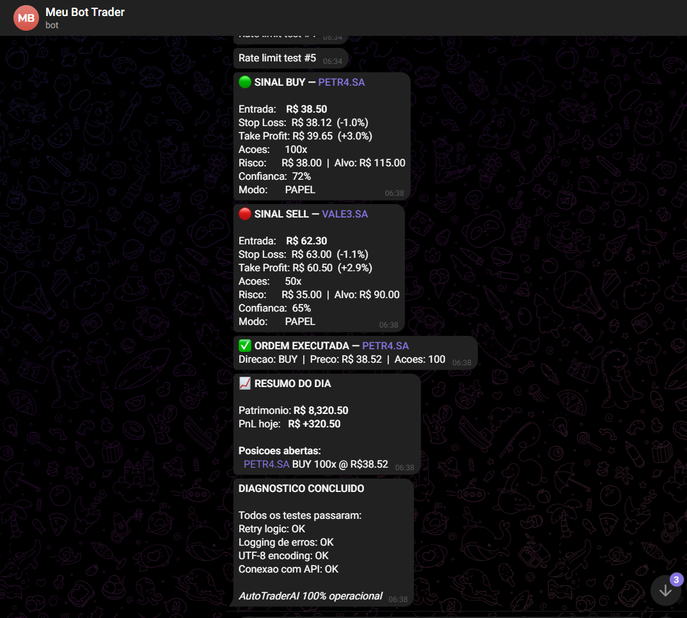

# Systematic Alpha — AutoTraderAI

Pipeline de trading quantitativo ML-driven para a **B3 (Bolsa Brasileira)**, com validação walk-forward rigorosa, backtesting realista e gestão de risco institucional.

[](https://github.com/DavidCumaru/AutoTraderAI/actions/workflows/daily_scan.yml)
[](https://github.com/DavidCumaru/AutoTraderAI/actions/workflows/weekly_retrain.yml)

---

## Visão Geral

O **Systematic Alpha** combina machine learning (LightGBM), feature engineering quantitativa e backtesting event-driven para pesquisar, validar e operar estratégias de alpha em múltiplos ativos da B3.

**Capacidades principais:**
- 37+ features quantitativas causais (técnicas, macro, sazonalidade, estrutura de mercado)
- Rotulagem Triple-Barrier adaptativa (ATR ou percentual fixo)
- Walk-Forward Validation rolling/expanding com rastreamento de IC por fold
- Backtester event-driven com slippage, comissão, spread e impacto de mercado
- Métricas institucionais: Sharpe (com IC bootstrap 95%), Sortino, Omega, Calmar, IC/ICIR
- Alocação multi-ticker: risk parity, min-variance, max-Sharpe
- Detecção de regime GMM/HMM com performance condicional
- Paper broker local — sem API key, estado persistido em JSON
- Dashboard interativo Streamlit com monitoramento ao vivo
- Rastreamento de experimentos MLflow
- Notificações via Telegram (sinais, resumo diário, resumo semanal)
- Automação diária e retreinamento semanal via GitHub Actions

---

## Notificações Telegram

O sistema envia alertas automáticos para o Telegram em tempo real:

- **Sinal gerado** — ticker, direção (BUY/SELL), preço de entrada, stop, target, confiança
- **Ordem executada** — confirmação de preenchimento no paper broker
- **Resumo diário** — patrimônio, P&L do dia, posições abertas (17:35 BRT)
- **Resumo semanal** — trades fechados, taxa de acerto, melhor/pior trade (sexta-feira)

### Exemplo de Notificação

<!-- ============================================================ -->
<!-- SUBSTITUA A LINHA ABAIXO PELA SUA IMAGEM DO TELEGRAM        -->
<!-- Arraste a imagem para a pasta docs/images/ e ajuste o path  -->
<!-- Exemplo:               -->
<!-- ============================================================ -->

> *Adicione aqui um screenshot das notificações do Telegram.*
> Para inserir: salve a imagem em `docs/images/telegram.png` e substitua a linha acima por:
> ``

---

## Resultados — Backtesting Walk-Forward (B3, 2004–2026)

> Estratégia: LightGBM Long/Short especializado, rótulos Triple-Barrier (TP 3% / SL 1% / TIME 3 dias).
> Capital: R$ 8.000. Custos: 5 bps slippage + R$ 1 comissão + 2 bps spread por trade.
> Walk-forward: 24 meses treino / 6 meses teste, janela rolling.

### Tickers Ao Vivo (Holdout — melhores 8 do backteste honesto)

| Ticker | Empresa | Retorno Total | Sharpe | Max DD | Taxa Acerto | Trades |
|--------|---------|--------------|--------|--------|-------------|--------|
| PRIO3.SA | PetroRio | — | — | — | — | — |
| LREN3.SA | Lojas Renner | — | — | — | — | — |
| SUZB3.SA | Suzano | — | — | — | — | — |
| EQTL3.SA | Equatorial | — | — | — | — | — |
| ITUB4.SA | Itaú Unibanco | — | — | — | — | — |
| VIVT3.SA | Telefônica | — | — | — | — | — |
| KLBN11.SA | Klabin | — | — | — | — | — |
| BBAS3.SA | Banco do Brasil | — | — | — | — | — |

> Preencha os resultados após rodar `python main.py --mode research --tickers PRIO3.SA ...`

---

## Arquitetura

```
AutoTraderAI/
├── autotrader/                   # Pacote Python principal
│   ├── config/
│   │   ├── settings.py           # Todos os parâmetros (paths, tickers, risco)
│   │   └── ticker_config.py      # Parâmetros por ticker (JSON)
│   ├── data/
│   │   ├── pipeline.py           # yfinance -> SQLite (incremental)
│   │   ├── alternative.py        # Google Trends, dados macro
│   │   └── news.py               # CVM filings, sentimento de notícias
│   ├── features/
│   │   └── engineering.py        # 37+ features quantitativas causais
│   ├── labeling/
│   │   └── barriers.py           # Triple-Barrier (-1/0/+1)
│   ├── models/
│   │   ├── trainer.py            # LightGBM + Optuna HPO (Long/Short especializado)
│   │   ├── walk_forward.py       # WFV rolling/expanding + MLflow + IC
│   │   └── regime.py             # Classificador de regime GMM/HMM
│   ├── backtesting/
│   │   ├── engine.py             # Backtester event-driven (params por ticker)
│   │   ├── holdout.py            # Holdout honesto out-of-sample
│   │   └── wfv_monthly.py        # Variante mensal de walk-forward
│   ├── execution/
│   │   ├── engine.py             # Geração de sinais + scan multi-ticker
│   │   ├── paper_broker.py       # Paper broker local (estado JSON)
│   │   └── broker_mt5.py         # Integração MetaTrader 5 (B3)
│   ├── risk/
│   │   ├── management.py         # Kelly sizing + kill-switches RiskGuard
│   │   ├── portfolio.py          # Alocação multi-ticker
│   │   ├── position.py           # Rastreamento de posições
│   │   └── market_impact.py      # Modelo Almgren-Chriss (raiz quadrada)
│   ├── analysis/
│   │   ├── performance.py        # Métricas institucionais + curva de equity
│   │   └── factors.py            # IC, ICIR, signal decay, atribuição de fatores
│   └── utils/
│       ├── logging.py            # setup_logging() centralizado
│       ├── notifier.py           # Alertas Telegram
│       └── journal.py            # Journal de trades (sinal -> P&L)
├── scripts/
│   ├── grid_search.py            # Grid search exaustivo (2.688 combos/ticker)
│   └── optimize_rr.py            # Otimização de risco/retorno TP/SL/TIME
├── tests/                        # 11 módulos pytest (~60 classes de teste)
├── .github/workflows/
│   ├── daily_scan.yml            # Scan diário B3 (10:10 BRT, seg-sex)
│   └── weekly_retrain.yml        # Retreinamento semanal (sáb 07:00 BRT)
├── data/                         # SQLite, estado do broker, params por ticker
├── models/                       # Modelos LightGBM salvos (.pkl)
├── logs/                         # Curvas de equity, sinais CSV, logs
├── trades/                       # journal.csv — histórico de trades
├── main.py                       # Orquestrador — 5 modos de execução
├── scheduler.py                  # Automação diária (09:30/10:10/17:35 BRT)
├── dashboard.py                  # Dashboard Streamlit (5 abas)
└── requirements.txt              # Dependências Python
```

---

## Instalação

### Pré-requisitos

- Python 3.11+
- Git

### Setup Local

```bash
# Clonar repositório
git clone https://github.com/DavidCumaru/AutoTraderAI.git
cd AutoTraderAI

# Criar e ativar ambiente virtual
python -m venv venv
venv\Scripts\activate           # Windows
source venv/bin/activate        # Linux/macOS

# Instalar dependências (Linux: MetaTrader5 é excluído automaticamente)
pip install -r requirements.txt
```

### Configurar Telegram (opcional)

```bash
# Copiar template de variáveis de ambiente
cp .env.example .env

# Editar .env e preencher:
# TELEGRAM_TOKEN=123456:ABC-DEF...
# TELEGRAM_CHAT_ID=987654321
```

Sem Telegram configurado, o sistema opera em modo silencioso (apenas logs locais).

---

## Uso

### Modos de Execução

```bash
# Baixar/atualizar dados de mercado para tickers específicos
python main.py --mode update --tickers PRIO3.SA LREN3.SA SUZB3.SA

# Pipeline completo de pesquisa (features -> labels -> WFV -> backtest -> análise)
python main.py --mode research --tickers PRIO3.SA LREN3.SA SUZB3.SA EQTL3.SA

# Pesquisa com parâmetros otimizados por ticker
python main.py --mode research --use-ticker-params --tickers PRIO3.SA LREN3.SA

# Análise de portfólio multi-ticker
python main.py --mode portfolio

# Treinar e salvar modelo final para um ticker
python main.py --mode train --ticker PRIO3.SA

# Gerar sinais ao vivo (roteados ao paper broker)
python main.py --mode live --ticker PRIO3.SA
```

### Scan Diário Manual

```bash
# Executa atualização de dados + scan de sinais imediatamente
python scheduler.py --agora
```

### Grid Search (Otimização de Parâmetros)

```bash
# Grid search para os tickers ao vivo (~1h total)
python scripts/grid_search.py --tickers PRIO3.SA LREN3.SA SUZB3.SA EQTL3.SA

# Resultados salvos em:
#   data/ticker_params.json   (melhores params por ticker)
#   logs/grid_search.csv      (todos os resultados)
```

**Espaço de busca (2.688 combinações por ticker):**

| Parâmetro | Valores |
|-----------|---------|
| `min_proba_threshold` | 0.48, 0.52, 0.56, 0.60 |
| `stop_loss_pct` | 0.5%, 0.7%, 1.0%, 1.5% |
| `take_profit_pct` | 0.8%, 1.2%, 1.8%, 2.5% |
| `time_stop_bars` | 2, 3, 5 |
| `direction` | both, long_only |
| `regime_filter` | all, Bull, Bear, Sideways, Bull+Sideways, Bear+Sideways, Bear+Bull |

### Dashboard Streamlit

```bash
streamlit run dashboard.py
# Abre em http://localhost:8501
```

| Aba | Conteúdo |
|-----|----------|
| Overview | KPIs do portfólio, equity, P&L total, taxa de acerto, posições abertas |
| Signals | Feed de sinais com filtros por direção/ticker/confiança |
| Paper Broker | Posições abertas, trades fechados, saldo em caixa |
| Performance | Curvas de equity por ticker (PNG), retornos mensais |
| Factor & Regime | Tabela IC/ICIR, grau do sinal, performance por regime |

---

## Automação — GitHub Actions

O sistema roda automaticamente no GitHub Actions sem nenhuma infraestrutura local:

### Scan Diário B3

**Horário:** 10:10 BRT (segunda a sexta)

```
Checkout → Instala deps → Valida imports → Restore cache DB
→ Atualiza dados → Scan de sinais → Notifica Telegram
→ Commita journal → Salva cache
```

### Retreinamento Semanal

**Horário:** Sábado 07:00 BRT

```
Checkout → Instala deps (mlflow + pandas<3) → Valida imports → Restore cache DB
→ Atualiza dados (8 tickers) → Retreina modelos (WFV + Optuna)
→ Salva cache DB → Commita modelos no git
```

Para disparar manualmente: **Actions → Scan Diario B3 → Run workflow**

---

## Estágios do Pipeline

| Estágio | Módulo | Descrição |
|---------|--------|-----------|
| 1 | `autotrader.data.pipeline` | Download OHLCV (yfinance), armazena em SQLite incrementalmente |
| 2 | `autotrader.features.engineering` | Constrói 37+ features causais |
| 3 | `autotrader.labeling.barriers` | Rótulos Triple-Barrier (-1/0/+1) |
| 4 | `autotrader.models.walk_forward` | WFV rolling 24m treino / 6m teste, rastreamento de IC |
| 5 | `autotrader.backtesting.engine` | Simulação event-driven com params por ticker + filtro de regime |
| 6 | `autotrader.analysis.performance` | Métricas institucionais + bootstrap Sharpe CI + curva de equity |
| 7 | `autotrader.analysis.factors` | IC, ICIR, signal decay, atribuição de fatores, custo de turnover |
| 8 | `autotrader.models.regime` | Classificação GMM de regime + breakdown de performance |
| 9 | `autotrader.models.trainer` | Treina modelos Long/Short finais em todos os dados |
| 10 | `autotrader.execution.engine` | Exporta CSV de sinais + roteamento ao paper broker |

---

## Configuração

Todos os parâmetros estão centralizados em [autotrader/config/settings.py](autotrader/config/settings.py):

```python
# Universo de tickers B3
TICKERS = ["BOVA11.SA", "PETR4.SA", "VALE3.SA", "ITUB4.SA", ...]

# Tickers ao vivo (holdout — melhores 8)
LIVE_TICKERS = ["PRIO3.SA", "LREN3.SA", "SUZB3.SA", "EQTL3.SA",
                "ITUB4.SA", "VIVT3.SA", "KLBN11.SA", "BBAS3.SA"]

# Walk-forward
TRAIN_MONTHS = 24   # 2 anos de treino
TEST_MONTHS  = 6    # 6 meses de teste
EMBARGO_BARS = 3    # evita leakage treino->teste

# Parâmetros de execução (substituídos por ticker após grid search)
MIN_PROBA_THRESHOLD = 0.58   # confiança mínima para gerar sinal
STOP_LOSS_PCT       = 0.010  # 1.0% stop loss
TAKE_PROFIT_PCT     = 0.030  # 3.0% take profit (R:R 3:1)
TIME_STOP_BARS      = 3      # máximo de dias na posição

# Risco
RISK_PER_TRADE   = 0.01   # 1% do capital por trade
DAILY_STOP_PCT   = 0.03   # 3% perda diária -> kill-switch
MAX_DRAWDOWN_PCT = 0.10   # 10% drawdown -> halt

# Broker
BROKER_MODE = "paper"   # "paper" | "mt5" | "mt5_dry"
```

Overrides por ticker são salvos em `data/ticker_params.json` (gerado pelo `grid_search.py`).

---

## Tech Stack

| Componente | Tecnologia |
|-----------|-----------|
| Linguagem | Python 3.11+ |
| Dados | pandas 3.x, numpy 2.x, yfinance 1.x |
| ML | LightGBM 4.x (modelos Long/Short especializados) |
| HPO | Optuna 4.x (Bayesian, 15 trials/fold) |
| Experiment Tracking | MLflow 3.x |
| Backtesting | Engine event-driven customizado |
| Otimização de Params | Grid search exaustivo (2.688 combos/ticker) |
| Paper Broker | Broker JSON local (fills via yfinance) |
| Dashboard | Streamlit 1.x + Plotly 6.x |
| Notificações | Telegram Bot API |
| Agendamento | schedule 1.x + GitHub Actions |
| Visualização | matplotlib 3.x, Plotly 6.x, Pillow 12.x |
| CI/CD | GitHub Actions (scan diário + retrain semanal) |
| Testes | pytest |

Todas as dependências são **gratuitas e open-source**. Nenhuma API key paga necessária.

---

## Saídas do Pipeline

| Caminho | Descrição |
|---------|-----------|
| `data/market_data.db` | Banco SQLite OHLCV (histórico por ticker) |
| `data/paper_broker.json` | Estado do paper broker (posições, trades, caixa) |
| `data/ticker_params.json` | Parâmetros otimizados por ticker (grid search) |
| `models/model_final_<ticker>.pkl` | Modelo LightGBM treinado para trading ao vivo |
| `logs/equity_curve_<ticker>.png` | Curva de equity do backtest com painel de drawdown |
| `logs/signals_<ticker>.csv` | Previsões de sinais OOS do WFV |
| `logs/pipeline.log` | Log completo de execução |
| `trades/journal.csv` | Journal de trades (sinal → P&L reconciliado) |
| `mlruns/` | Experimentos MLflow (métricas, params, artefatos) |

---

## Features Quantitativas (37+)

- **Retornos:** log-retornos (lags 1–5), momentum multi-janela (5/10/20d), momentum 12-1 meses
- **Técnicas:** RSI-14, MACD (12/26/9), ATR-14, desvio VWAP, distância MA200
- **Volatilidade:** vol rolling (5/21d), Garman-Klass realized vol
- **Volume:** ratio de spike de volume, proxy de iliquidez Amihud
- **Estrutura de Mercado:** desequilíbrio de ordens, proximidade da máxima de 52 semanas, flags de breakout
- **Macro/Regime:** nível do VIX, Beta rolling vs BOVA11, spread de juros
- **Sazonalidade:** dia da semana, mês do ano, proximidade de resultados
- **Alternativas:** Google Trends z-score (atenção do varejo ao ticker)
- **Z-scores:** normalização de preço e volume em janelas rolling

---

## Testes

```bash
# Rodar todos os testes
pytest tests/ -v

# Com cobertura e timeout
pytest tests/ --cov=autotrader --timeout=120 -v

# Verificações de sanidade (bias de look-ahead, disciplina de posição)
pytest tests/test_sanity.py -v
```

| Módulo | O que testa |
|--------|-------------|
| `test_data_pipeline.py` | Operações no banco, atualizações incrementais |
| `test_feature_engineering.py` | 37+ features, validação de causalidade |
| `test_labeling.py` | Triple-Barrier, ATR vs percentual fixo |
| `test_model_training.py` | Fit LightGBM, Optuna, seleção de features |
| `test_backtest_engine.py` | Execução de trades, P&L, slippage, comissão |
| `test_execution_engine.py` | Geração de sinais, filtro de probabilidade |
| `test_portfolio_manager.py` | Métodos de alocação, bloqueio por correlação |
| `test_risk_management.py` | Sizing, Kelly, kill-switches RiskGuard |
| `test_performance.py` | Sharpe anualizado, drawdown |
| `test_sanity.py` | Bias de look-ahead (RSI, momentum, rótulos) |

---

## Aviso Legal

Este software é apenas para **fins de pesquisa e educação**. Não constitui conselho financeiro. Performance passada em backtest não garante resultados futuros. Trading algorítmico envolve risco financeiro significativo. Use paper trading antes de qualquer capital real.

Os resultados de backtest apresentados são **out-of-sample** (walk-forward validation), não in-sample. Os retornos são modestos por design — a estratégia prioriza baixo drawdown e risco controlado.

---

## Licença

MIT License — veja [LICENSE](LICENSE) para detalhes.
